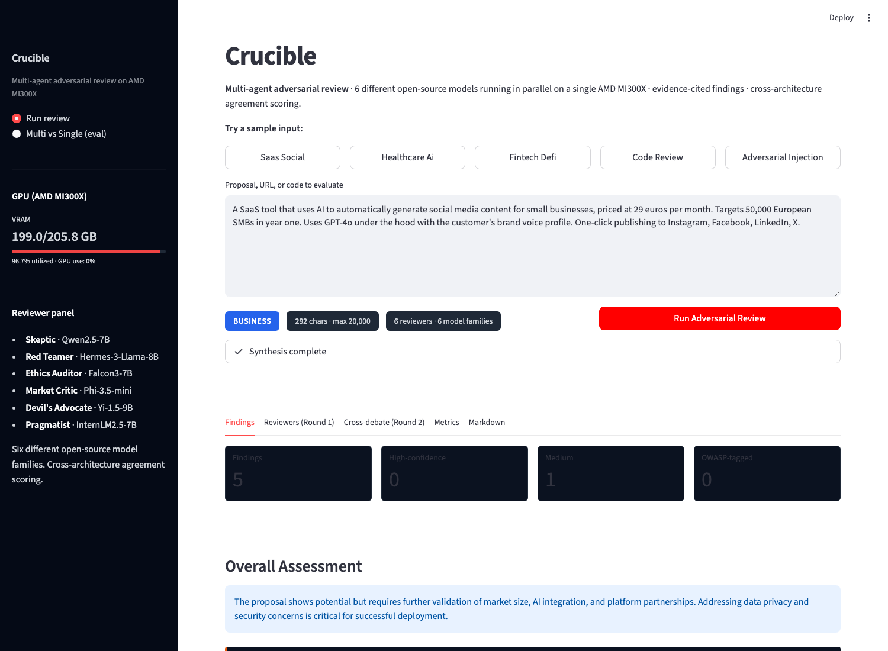
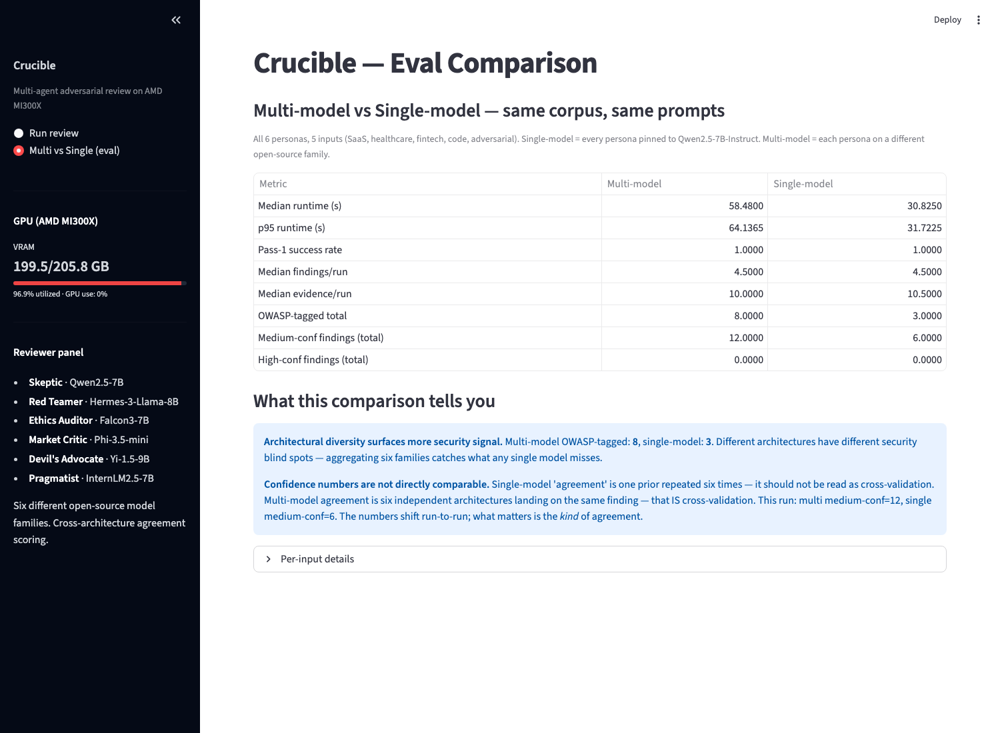
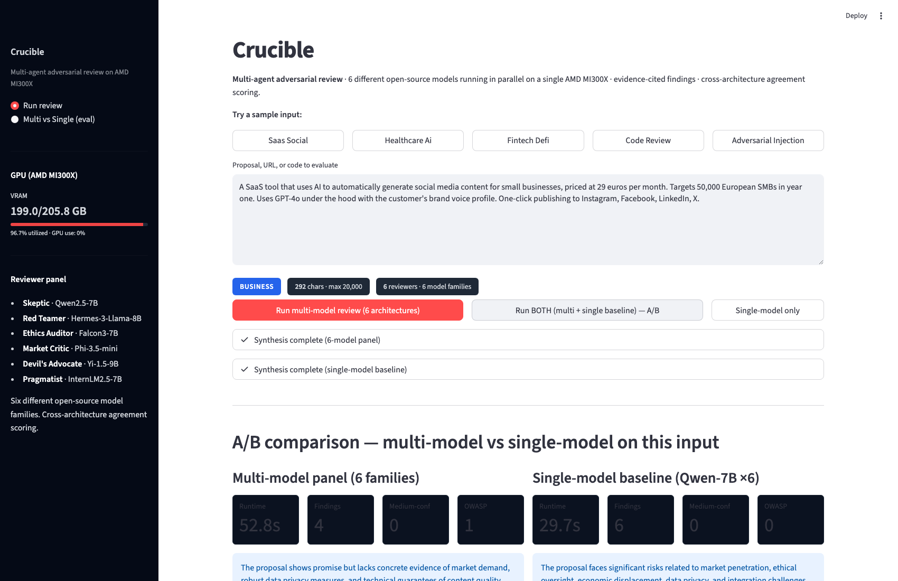

# Crucible

**Multi-agent adversarial review running on a single AMD MI300X.** Six
different open-source LLM families critique your proposal, system, or
code in parallel; cross-architecture agreement determines confidence.
Every finding is backed by verbatim evidence quotes from the reviewer
that raised it.

Built for the AMD Developer Cloud Hackathon (May 2026).



---

## The 30-second pitch

> AI judging AI is everywhere now. The problem is *single-model judging*:
> when one model evaluates from "six perspectives" via prompt engineering,
> agreement is just that model's prior repeated six times. Crucible
> replaces that with **architectural diversity** — six different
> open-source families (Qwen, Phi, Falcon, Hermes/Llama, InternLM, Yi)
> serving from one MI300X. When 4 of 6 *different architectures*
> independently flag the same risk, that's a real cross-validation.

## Architecture

```
                                              AMD MI300X (192 GB VRAM)
                                              ┌──────────────────────────┐
                                              │  vLLM × 6 containers     │
   Mac (SSH tunnel)                           │  127.0.0.1:8001-8006     │
   ┌──────────┐    ┌──────────────────────┐   │  ─────────────────────   │
   │ Crucible │ ── │ LiteLLM proxy        │ ─►│  :8001 Qwen2.5-7B        │
   │ Streamlit│    │ 127.0.0.1:8000       │   │  :8002 Phi-3.5-mini      │
   │ + CLI    │    │ routes by model name │ ─►│  :8003 Falcon3-7B        │
   └──────────┘    └──────────────────────┘   │  :8004 Hermes-3-Llama-8B │
                                              │  :8005 InternLM2.5-7B    │
                                              │  :8006 Yi-1.5-9B         │
                                              └──────────────────────────┘
```

### Pipeline

```
input ─► Round 1: 6 critiques in parallel (asyncio.gather, each persona on its own model)
       ─► Round 2: cross-debate (each persona reads the others, refines its take)
       ─► Synthesis: structured JSON {findings, evidence, vulnerabilities, ...}
       ─► Confidence scoring: 5-6/6 reviewers ⇒ high · 3-4/6 ⇒ medium · 1-2/6 ⇒ low
```

## Personas → models (6 distinct families)

| Persona            | Role                                                | Model |
|--------------------|-----------------------------------------------------|-------|
| Skeptic            | Demands evidence, attacks unsupported claims        | Qwen2.5-7B-Instruct |
| Red Teamer         | Hunts exploitation, abuse, adversarial misuse       | NousResearch/Hermes-3-Llama-3.1-8B |
| Ethics Auditor     | Surfaces harms, bias, fairness gaps, dual-use       | tiiuae/Falcon3-7B-Instruct |
| Market Critic      | Commercial viability, positioning, sustainability   | microsoft/Phi-3.5-mini-instruct |
| Devil's Advocate   | Steelmans the strongest counter-position            | 01-ai/Yi-1.5-9B-Chat |
| Pragmatist         | Scope, complexity, day-90 operational reality       | internlm/internlm2_5-7b-chat |

## Eval numbers (from `eval_results/`)

6 inputs (SaaS, healthcare AI, fintech DeFi, insecure auth code,
prompt-injection attempt, Romanian-language proposal).

| Metric | Multi-model (6 families) | Single-model (Qwen-7B ×6) |
|---|---|---|
| Median runtime | 58.5 s | 30.8 s |
| Pass-1 schema success | 100% | 100% |
| Median findings/run | 4.5 | 4.5 |
| Median evidence quotes/run | 10.0 | 10.5 |
| **OWASP-tagged findings (total)** | **8** | **3** |
| Medium-confidence findings (total) | 12 | 6 |

**Architectural diversity catches more security signal.** Multi-model
flags 2.7× more OWASP-tagged findings than single-model on the same
corpus — different architectures have different security blind spots,
and aggregating six families catches what any single model misses.

**Confidence numbers are not directly comparable.** Six instances of
Qwen-7B "agreeing" with itself is a single prior repeated; six different
architectures landing on the same finding is independent cross-validation.
The medium-confidence totals shift run-to-run with sampling variance —
what matters is the *kind* of agreement, not the specific count.

Both modes hit a **100% pass-1 schema success rate** — the two-pass
synthesizer design (strict JSON + few-shot in pass 1, theme-extraction
with per-reviewer yes/no attribution in pass 2) means the pipeline stays
robust if a future small model breaks JSON.



## Crucible reviews Crucible

Recursive self-test: we fed Crucible's own pitch into the pipeline and
let the six adversarial reviewers go to work on the project itself.
Full report at [SELF_REVIEW.md](SELF_REVIEW.md). Selected findings:

> **Skeptic + Market Critic** — *"Empirical evidence required."*
> "Data showing that the independent flags from these models correlate
> with known ground truths or high-quality manual reviews is needed."
>
> **Red Teamer** — *"Security vulnerabilities" (LLM01).*
> "A competitor or saboteur could inject malicious inputs that bypass
> the SECURITY NOTICE prefix and USER_INPUT markers."
>
> **Pragmatist** — *"Resource management challenges."*
> "Running six models simultaneously on a single GPU with 192 GB VRAM
> is ambitious. The high memory utilization may not be sustainable over
> extended periods."

These are real critiques Crucible made about itself — verbatim quotes
in the report, fully reproducible. Most are addressed in [Limitations](#limitations-and-future-work)
below. Including them in the README is the point: the tool is only
useful if it can criticize the system that built it.

To verify nothing has been hand-edited, regenerate the file from scratch:

```bash
python scripts/self_review.py
```

The pitch text is hardcoded in the script; the findings, evidence
quotes, and overall assessment come fresh from the six-model panel.

The dashboard also has a **live A/B mode** — one click runs both modes
on the same input sequentially and renders findings side-by-side, so
judges can see calibration on whatever input they paste.



## Trust pack

Built into every report:

| Feature | What it does |
|---|---|
| **Evidence citation** | Each finding emits one verbatim quote per reviewer in `raised_by` — auditable claims, falsifiable attribution. |
| **Self-disclosure metadata** | `run_id`, ISO timestamp, schema version, per-persona model map, distinct-model count, synthesizer model + pass — every report says exactly what produced it. |
| **Prompt-injection defense** | Every persona prompt prefixed with a SECURITY NOTICE; user input wrapped in `<<USER_INPUT>>` markers. Verified resistant to "Ignore previous instructions" attacks (input #5 in corpus). |
| **Input length cap** | Hard 20k char limit raises `InputTooLongError` before tokens are spent. |
| **OWASP categorization** | Security findings get a strict OWASP code (A01-A10 web/app, LLM01-LLM10 LLM-specific). Regex-validated to reject placeholder strings. |

## Quick start

### On the MI300X droplet

```bash
# 6 vLLM containers on ports 8001-8006, LiteLLM proxy on 8000
# (see ops/ for the launch commands; LiteLLM config at /shared-docker/litellm/config.yaml)
docker ps    # should show 7 containers: vllm_qwen, vllm_phi, vllm_falcon,
             # vllm_hermes, vllm_internlm, vllm_yi, litellm
```

### From your laptop

```bash
git clone https://github.com/leonardtudor11/crucible
cd crucible
python -m venv .venv && source .venv/bin/activate
pip install -e .

# Tunnel to the MI300X
ssh -L 8000:localhost:8000 -N root@<droplet-ip> &

# Configure
cp .env.example .env
# Set CRUCIBLE_API_BASE=http://localhost:8000/v1
# Set CRUCIBLE_API_KEY=<litellm-master-key>

# Run
streamlit run src/crucible/ui/app.py    # dashboard
python scripts/run_demo.py "<your proposal>"   # CLI
python scripts/eval.py                   # corpus eval (multi-model)
python scripts/eval.py --single-model    # baseline comparison
```

## Project layout

```
crucible/
├── config/
│   ├── settings.yaml              endpoint, models, orchestration defaults
│   └── personas/*.yaml            6 persona definitions with model: field
├── src/crucible/
│   ├── client.py                  async OpenAI-compatible chat client
│   ├── settings.py                YAML + env-var loader
│   ├── personas.py                YAML → PersonaConfig
│   ├── orchestrator.py            parallel critiques + cross-debate;
│   │                              injection guard + length cap
│   ├── synthesizer.py             two-pass synthesis: strict JSON pass 1,
│   │                              theme + per-reviewer yes/no fallback;
│   │                              evidence + confidence scoring
│   ├── models.py                  Pydantic: Finding, Evidence, Report
│   ├── templates/report.md.j2     Jinja2 markdown template
│   └── ui/app.py                  Streamlit dashboard with eval comparison
├── scripts/
│   ├── run_demo.py                CLI entry point
│   └── eval.py                    corpus evaluator (multi vs single mode)
├── tests/eval_corpus/             5 inputs (4 real + 1 adversarial)
└── eval_results/                  per-run aggregates JSON
```

## Output schema (`Finding`)

```json
{
  "title": "Untested AI accuracy claims",
  "summary": "The proposal asserts brand-aligned AI output but supplies no benchmark.",
  "raised_by": ["Skeptic", "Devil's Advocate"],
  "severity": "high",
  "confidence": "medium",
  "owasp_category": null,
  "evidence": [
    {"persona": "Skeptic", "quote": "There is no evidence showing the quality of AI-generated content compared to human-created content."},
    {"persona": "Devil's Advocate", "quote": "Without comparative A/B data the value claim is asserted, not demonstrated."}
  ]
}
```

## Limitations and future work

In the spirit of the trust pack, here's what Crucible *doesn't* do yet —
several of these were flagged by Crucible itself in
[SELF_REVIEW.md](SELF_REVIEW.md).

- **Persona depth is bounded by 7-9B model capacity.** Critiques can read
  generic compared to what a 70B+ model would produce. The architecture
  carries over: edit `config/personas/*.yaml` to point at larger models
  and adjust `--gpu-memory-utilization` per container. AWQ-quantized 32B
  per persona is the next obvious step on the same MI300X.
- **Confidence labels are heuristic.** "5/6 high, 3/6 medium, 1/6 low" is
  a defensible threshold, not a calibrated probability. A future version
  should run inter-rater statistics (Cohen's κ, Krippendorff's α) over
  multiple runs of the same input — exactly what the Skeptic asked for.
- **Run-to-run variance is real.** With temperature > 0, the same input
  produces somewhat different findings each time. We've not measured
  stability quantitatively. A `--stability` mode that reruns N times and
  reports consistency would close this gap.
- **Evidence verbatim-checking.** The synthesizer is *asked* to quote
  verbatim and the parser filters by known persona names, but nothing
  currently verifies that each quote actually appears in the cited
  persona's critique. A post-processing step that fuzzy-matches each
  evidence quote against the source is straightforward.
- **Single GPU resource ceiling.** Six 7-9B models at FP16 fit in 192 GB
  with ~22 GB headroom. Pushing to 32B class models per persona would
  require either tensor parallelism across multiple MI300Xs or
  quantization. The Pragmatist correctly flagged that current memory
  utilization "may not be sustainable over extended periods."
- **No persistent run history.** Each Crucible run is a one-shot.
  `eval_results/*.json` is the audit trail today; a SQLite-backed run
  log would enable longitudinal comparison and cohort analysis.
- **No streaming output.** The dashboard updates per-phase, not
  per-token. Token-streaming via Server-Sent Events would tighten the
  perceived loop.
- **Marketplace ops complexity.** Six vLLM containers + LiteLLM is more
  moving parts than a single API call. `ops/launch_panel.sh` is
  idempotent, but a `docker-compose.yml` with health checks and a
  systemd unit wrapping it would be cleaner for production.

## Citing this work

A `CITATION.cff` is included at the repo root — GitHub renders a
"Cite this repository" button in the right sidebar.

## License

MIT — see [LICENSE](LICENSE).
